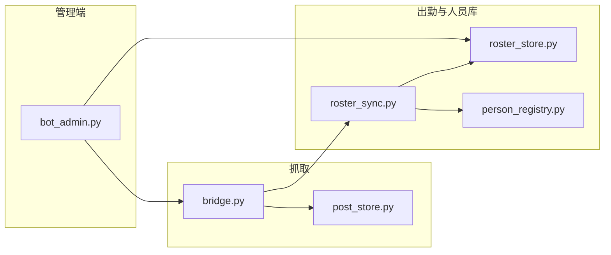

# Telegram 频道抓取 · 模板提取 · 人员库 · 手动发布

从 **两个源频道** 抓取相册+配文，结合 **两个出勤群** 的在岗名单，合并同一人资料写入 **人员库**，经管理 Bot 预览后手动发布到统一榜（目标频道）。

支持：广告过滤、去源站痕迹、内容指纹去重、目标频道名字去重、电报不全先入 draft、人员库批量删除。

**仓库：** https://github.com/joeykini/tggroupchannel

---

## 与「麻辣鹅社区 Bot」的区别

| 项目 | 本仓库 `tggroupchannel` | 另一项目 `tgbot_group` |
|------|-------------------------|-------------------------|
| 作用 | 源站抓取 → 人员库 → 发布到统一榜 | 社区关键词回复、资源按钮 |
| 抓取 | Telethon 监听 2 源频道 + 2 出勤群 Bot | HTTP 抓 `@huaianbendi` 公开页 |
| 数据 | SQLite `persons` 人员库 | SQLite `resources` 资源表 |
| 发布 | 管理 Bot `/library` 手动/批量发布 | 无发布流程 |

---

## Git 仓库：克隆 / 拉取 / 推送

### 首次克隆（服务器或本机）

```bash
git clone https://github.com/joeykini/tggroupchannel.git ~/tggroupchannel
cd ~/tggroupchannel
python3 -m venv .venv
source .venv/bin/activate
pip install -r requirements.txt
cp .env.example .env
# 编辑 .env 后
python forwarder.py login
```

### 日常更新（服务器拉最新代码）

```bash
cd ~/tggroupchannel
pkill -f "forwarder.py run"    # 先停进程
git pull
source .venv/bin/activate
# 若 requirements.txt 有变：pip install -r requirements.txt
nohup python forwarder.py run > nohup.out 2>&1 &
tail -f nohup.out
```

### 开发者推送改动

```bash
cd ~/tggroupchannel
git status
git add .
git commit -m "说明本次改动的目的"
git push origin main
```

推送前请确认 `.env`、`user.session`、`data/` 未纳入提交（已在 `.gitignore`）。

---

## 快速开始（命令行）

```bash
cd ~/tggroupchannel          # 或你的项目目录
python3 -m venv .venv        # 注意是 .venv，不是 venv
source .venv/bin/activate
pip install -r requirements.txt
cp .env.example .env         # 填写 API_ID、API_HASH、SOURCE_CHANNELS、TARGET_CHANNEL
python forwarder.py login
python forwarder.py run
```

## 服务器部署与后台运行

项目在服务器上默认使用 **`.venv`**（带点），激活命令是：

```bash
source .venv/bin/activate    # 不是 venv/bin/activate
```

### 首次部署

```bash
cd ~/tggroupchannel
git clone https://github.com/joeykini/tggroupchannel.git .   # 若尚未克隆

# Debian/Ubuntu 若缺少 venv 模块
apt update
apt install -y python3-venv python3-pip git

python3 -m venv .venv
source .venv/bin/activate
pip install -r requirements.txt

cp .env.example .env
nano .env                      # 填写 API_ID、API_HASH、频道、BOT 等

python forwarder.py login      # 首次登录 Telegram
```

### 前台运行（调试）

```bash
cd ~/tggroupchannel
source .venv/bin/activate
python forwarder.py run
```

### 后台运行（推荐 nohup，无需 screen）

```bash
cd ~/tggroupchannel
source .venv/bin/activate

# 若已有旧进程，先停掉
pkill -f "forwarder.py run" 2>/dev/null

# 后台启动，日志写入 nohup.out
nohup python forwarder.py run > nohup.out 2>&1 &

# 查看是否在跑
ps aux | grep forwarder

# 实时看日志（Ctrl+C 只退出 tail，进程继续跑）
tail -f nohup.out
```

### 停止 / 更新 / 重启

```bash
cd ~/tggroupchannel

# 1. 停止
pkill -f "forwarder.py run"

# 2. 拉取最新代码
git pull

# 3. 激活环境（有依赖变更时再 pip install -r requirements.txt）
source .venv/bin/activate

# 4. （可选）立刻清理人员库：商k / 非淮安本地区
python forwarder.py roster

# 5. 重新后台启动
nohup python forwarder.py run > nohup.out 2>&1 &
tail -f nohup.out
```

### 可选：screen / systemd

未安装 screen 时可直接 `apt install -y screen`，或用 `tmux`。长期常驻也可配置 `systemd` 服务（见文末说明）。

## 命令

| 命令 | 说明 |
|------|------|
| `python forwarder.py login` | 命令行登录（首次必做） |
| `python forwarder.py run` | 监听源频道，自动抓取/模板提取/发布 |
| `python forwarder.py fetch --limit 30` | 立即补抓最近帖子 |
| `python forwarder.py sync` | 对比源频道删帖与内容重复 |
| `python forwarder.py roster` | 出勤名单同步：合并在岗、删不在岗（统一榜） |

## 出勤名单 + 统一榜（两组源）

| 组别 | 出勤群 | 源频道 |
|------|--------|--------|
| 1 | [@HuaiAnHub](https://t.me/HuaiAnHub) | [@huaian008](https://t.me/huaian008) |
| 2 | [@HuaiAn_YangZhou](https://t.me/HuaiAn_YangZhou) | [@huaian0901](https://t.me/huaian0901) |

统一发布到 [@huaianbendi](https://t.me/huaianbendi)：

- 🟢 在线 / 🔴 休息 **都在岗**（只要在出勤名单里就不删）
- 同一人跨频道 **合并资料**，写入人员库（**默认不自动发布**）
- 管理 Bot：**人员库** → 点名字预览 → 点发布 / 批量发布 / 批量删除
- 广告/无模板/非淮安本地区 **不入库**（`REGION_FILTER_ENABLED`、`ALLOWED_REGIONS`）
- 含「商k」等广告词 **不入库并自动清理**
- **电报/频道联系不全** → 仍入库，状态 `draft`（待补），不可发布直到补全
- **目标频道已发过同名老师** → 出勤/补抓后自动标为 `published`，避免重复显示「未发」
- **不在出勤名单** 且已发布过 → 可选删统一榜帖（`DELETE_INACTIVE_FROM_TARGET=true`）

```bash
python forwarder.py roster   # 手动：群内触发「出勤」→ 解析 → 刷新人员库 → 目标频道名字去重
```

---

## 人员库使用（管理 Bot）

配置 `BOT_TOKEN` + `BOT_ADMIN_IDS` 后，`python forwarder.py run` 会同时启动管理 Bot。

| 操作 | 步骤 |
|------|------|
| 打开人员库 | 发送 `/library` 或点底部 **📚 人员库** |
| 预览 | 点某人名字 → 查看合并后的预览文案 |
| 单条发布 | 预览页点 **✅ 发布到频道** |
| 批量发布 | 列表点 **📢 发布全部未发**，确认后按 `PUBLISH_INTERVAL_SECONDS` 间隔发送 |
| 批量删除 | 列表点 **🗑 批量删除** → 点名字勾选（☑）→ **确认删除** |
| 出勤同步 | **📋 出勤同步** 或 `/roster`：刷新在岗状态 + 合并资料 + 目标频道去重 |
| 补抓源帖 | **📥 补抓** 或 `/fetch`：抓源频道新帖入人员库 + 目标频道去重 |

### 列表图标含义

| 显示 | 含义 |
|------|------|
| 🟢 / 🔴 / ⚪ | 出勤：在线 / 休息 / 未知 |
| ✓ | 已在目标频道发布（`library_status=published`） |
| 待补 | 联系信息不全（`library_status=draft`），需补全电报或频道后再发 |
| ⚠ | 合并字段里电报/频道不完整 |

---

## 整体流程

```
源频道新帖（相册 + 配文）
    ↓
字段识别（template_extract + person_registry）
    ↓
广告/地区校验（content_validate）
    ↓
内容指纹去重（post_store，CONTENT_DEDUP_ENABLED）
    ↓
写入 posts 表 + 合并入 persons 人员库（不自动发布）
    ↓
出勤群 Bot 回复名单 → 更新 roster_status（online/resting/inactive）
    ↓
管理 Bot 预览 → 手动发布到 TARGET_CHANNEL
    ↓
补抓/出勤同步结束时 → 扫目标频道已发名字 → 标记 published（PERSON_DEDUP_ENABLED）
    ↓
定时 sync：检测源帖已删、补抓遗漏
```

---

## 代码结构与职责

便于二次开发时快速定位修改点。

```
telegrambot/
├── forwarder.py      # CLI 入口：run / login / fetch / sync / roster
├── bridge.py         # 频道监听、抓取、发布编排（ChannelBridge）
├── roster_sync.py    # 出勤抓取、人员库刷新、发布单人、目标频道名字去重
├── roster_store.py   # persons / roster_snapshots SQLite CRUD
├── roster_parse.py   # 解析出勤 Bot 回复文本
├── post_store.py     # posts 表：抓取帖、指纹、发布状态
├── person_registry.py# 同人 ID、字段合并、联系信息是否完整
├── content_validate.py # 入库前：广告、地区、模板字段校验
├── template_extract.py # 从文案提取 name/telegram/region 等
├── bot_admin.py      # 管理 Bot：人员库 UI、批量删、批量发
├── config.py         # .env + settings.json
└── data/             # SQLite、媒体缓存、session（勿提交 git）
```

### 核心模块关系



---

## 关键逻辑说明（便于改代码）

### 1. 人员库状态 `library_status`

| 值 | 含义 | 能否出现在「未发」/ 批量发布 |
|----|------|------------------------------|
| `draft` | 资料不全（常见：电报为空） | 否 |
| `ready` | 预览完整、联系信息齐全、未发布 | 是 |
| `published` | 已发布到目标频道（或去重标记） | 否 |
| `inactive` | 不在出勤名单 | 否 |

写入/更新主要在 `roster_sync.py` 的 `refresh_person_library()` 和 `ingest_post_to_library()`。

### 2. 联系信息是否完整

`person_registry.is_contact_complete(fields)`：

- 有有效 **频道链接**（长度 > 5），或
- **电报** 去掉 `@` 后用户名长度 ≥ 3

用于：

- `content_validate.validate_for_capture()`：不全也允许抓取入库
- `roster_sync.publish_person()`：不全则拒绝发布
- `roster_store.list_publishable_persons()`：过滤批量/未发列表

**要改「什么叫完整」**：只改 `person_registry.py` 里 `is_contact_complete` / `has_incomplete_contact`。

### 3. 目标频道名字去重（解决「已发仍显示未发」）

**触发时机**（`PERSON_DEDUP_ENABLED=true` 且配置了 `TARGET_CHANNEL`）：

1. `roster_sync.reconcile_all()` 末尾（出勤同步）
2. `bridge.fetch_recent_once()` 末尾（补抓）

**逻辑**（`roster_sync.py`）：

```
fetch_target_published_names()   # Telethon 扫目标频道最近 N 条帖，extract 名字
        ↓
mark_published_by_names()        # roster_store：draft/ready 且同名 → published
```

只比 **归一化后的名字**（`normalize_person_name`），不比地区。若要「名字+地区」去重，改 `mark_published_by_names()` 或 `make_person_id()` 的比对方式。

### 4. 电报不全仍入库

`content_validate.validate_for_capture()`：有名字+地区即可通过；若 `is_contact_complete` 为 false，跳过「模板至少 2 行有效字段」的严格检查。

`refresh_person_library()`：

- 联系不全 → `library_status='draft'`
- 仍生成 `preview_text`（模板渲染或「名字/地区/电报（待补全）」占位）

**要改占位文案**：搜 `（待补全）` 或 `ingest_post_to_library` 里的 fallback。

### 5. 人员库批量删除

`bot_admin.py`：

- 内存状态：`_delete_mode`、`_delete_selection[chat_id]`
- 回调：`lib:del:start` → `lib:del:toggle:{person_id}` → `lib:del:confirm`
- 落库：`roster_store.delete_persons(ids)`（只删 `persons` 表，不删 `posts`）

**若要删帖联动**：在 `delete_persons` 或 confirm 回调里增加 `mark_person_posts` / 删目标频道消息。

### 6. 同人合并

- `person_id = sha1(归一化名字|归一化地区)[:16]`（`person_registry.make_person_id`）
- 多源帖合并字段：`merge_profile_fields()`，长值优先（name/region 除外，新值覆盖）

### 7. 发布单人

`roster_sync.publish_person()`：

1. 合并该人所有 posts 字段
2. 校验广告/地区 + **联系完整**
3. 删旧目标帖 → 发 canonical 帖（图+caption）
4. `update_person(..., library_status='published')`

管理 Bot 单发走 `bridge.publish_person_by_id()` → 同上。

---

## 数据表（SQLite `data/posts.db`）

| 表 | 用途 |
|----|------|
| `posts` | 每条源帖：原文、指纹、media、person_id、target_message_ids |
| `persons` | 人员库：merged_fields、preview_text、library_status、roster_status |
| `roster_snapshots` | 每次出勤抓取的原始文本与解析条目 |

---

## 流程（旧版简图）

```
源频道新帖 → 字段识别 → 校验/去重 → 人员库 → 手动发布 → 目标频道名字去重
```

---

## 模板变量

`{name}` `{age}` `{height}` `{weight}` `{cup}` `{project}` `{price_once}` `{price_twice}` `{region}` `{telegram}` `{channel}` `{duplex}` 以及评分区 `{review_count}` `{good_rate}` `{photo_score}` 等。

源站即使用「昵称」「名字」「价位」「位置」等不同写法，也会映射到同一字段。

## 配置（.env）

| 变量 | 说明 |
|------|------|
| `SOURCE_CHANNELS` | 源频道，逗号分隔 |
| `TARGET_CHANNEL` | 目标频道 |
| `AI_ENABLED` | 关闭时按 `PUBLISH_TEMPLATE` 提取并重排 |
| `CONTENT_DEDUP_ENABLED` | 按内容指纹去重（源帖维度） |
| `PERSON_DEDUP_ENABLED` | 目标频道名字去重，标 published（默认开） |
| `SYNC_ENABLED` | 定时对比源频道删帖 |
| `SYNC_INTERVAL_MINUTES` | 同步间隔（分钟） |
| `DELETE_FROM_TARGET_ON_SOURCE_REMOVED` | 源删时同步删目标帖 |
| `BLOCKED_KEYWORDS` | 广告屏蔽词（含 `商k`） |
| `REGION_FILTER_ENABLED` | 仅允许本地区入库（默认开） |
| `ALLOWED_REGIONS` | 允许地区，逗号分隔（默认淮安 7 区县） |
| `ROSTER_SYNC_TIME` | 凌晨任务时间（默认 `02:30`） |
| `PUBLISH_INTERVAL_SECONDS` | 批量发布每条间隔（秒） |
| `AUTO_PUBLISH_AFTER_ROSTER` | 凌晨比对后是否自动发布（默认关） |
| `BOT_*` | 抓取/发布结果 TG Bot 推送 |
| `BOT_ADMIN_IDS` | 允许在 Bot 内改配置的管理员用户 ID |

`.env` 与 `settings.json` 均可配置，`settings.json` 优先。

## 管理 Bot（在 Telegram 内改参数）

配置 `BOT_TOKEN` 和 `BOT_ADMIN_IDS` 后，`python forwarder.py run` 会自动启动管理 Bot。

| 命令 | 说明 |
|------|------|
| `/library` | 人员库：预览、发布、批量删除 |
| `/menu` | 按钮面板（开关、同步、补抓） |
| `/status` | 查看当前配置 |
| `/sync` | 源频道同步（删帖标记、补抓） |
| `/roster` | 出勤同步 + 目标频道名字去重 |
| `/fetch` | 立即补抓源频道 |
| `/toggle dedup` | 切换内容指纹去重 |
| `/toggle ai` | 切换 AI / 自动发布 / 同步 等 |
| `/set source @a,@b` | 修改源频道 |
| `/set target @my_channel` | 修改目标频道 |
| `/set sync_interval 30` | 修改同步间隔（分钟） |
| `/help` | 完整说明 |

修改会写入 `settings.json` 并立即生效。仅 `BOT_ADMIN_IDS`（或 `BOT_CHAT_ID`）中的用户可操作。

获取你的用户 ID：给 [@userinfobot](https://t.me/userinfobot) 发消息即可。

---

## 常见改动入口（给维护者）

| 想改什么 | 优先看文件 |
|----------|------------|
| 抓取字段/模板别名 | `template_extract.py` |
| 入库规则（广告、地区） | `content_validate.py` |
| 同人 ID / 字段合并 | `person_registry.py` |
| 出勤群触发与解析 | `roster_sync.fetch_all_rosters`、`roster_parse.py` |
| 人员库 CRUD / 状态 | `roster_store.py` |
| 发布文案拼装 | `roster_sync._build_final_caption`、`config.publish_template` |
| 目标频道去重策略 | `roster_sync.dedup_against_target_channel`、`mark_published_by_names` |
| 管理 Bot 按钮与文案 | `bot_admin.py` |
| 定时任务 | `forwarder.py` 内 `_sync_scheduler` / `_roster_scheduler` / `_nightly_scheduler` |

---

## 权限

| 项目 | 要求 |
|------|------|
| 源频道 | 账号已加入 |
| 目标频道 | 账号为管理员，可发消息 |
| API | [my.telegram.org](https://my.telegram.org) |

## 安全

- 勿泄露 `user.session` 和 `.env`
- 服务器建议用 `nohup` 或 `systemd` 常驻 `python forwarder.py run`

### systemd 示例（可选）

```ini
# /etc/systemd/system/tg-forwarder.service
[Unit]
Description=Telegram channel forwarder
After=network.target

[Service]
Type=simple
User=root
WorkingDirectory=/root/tggroupchannel
Environment=PATH=/root/tggroupchannel/.venv/bin
ExecStart=/root/tggroupchannel/.venv/bin/python forwarder.py run
Restart=always
RestartSec=10

[Install]
WantedBy=multi-user.target
```

```bash
systemctl daemon-reload
systemctl enable tg-forwarder
systemctl start tg-forwarder
systemctl status tg-forwarder
journalctl -u tg-forwarder -f
```
